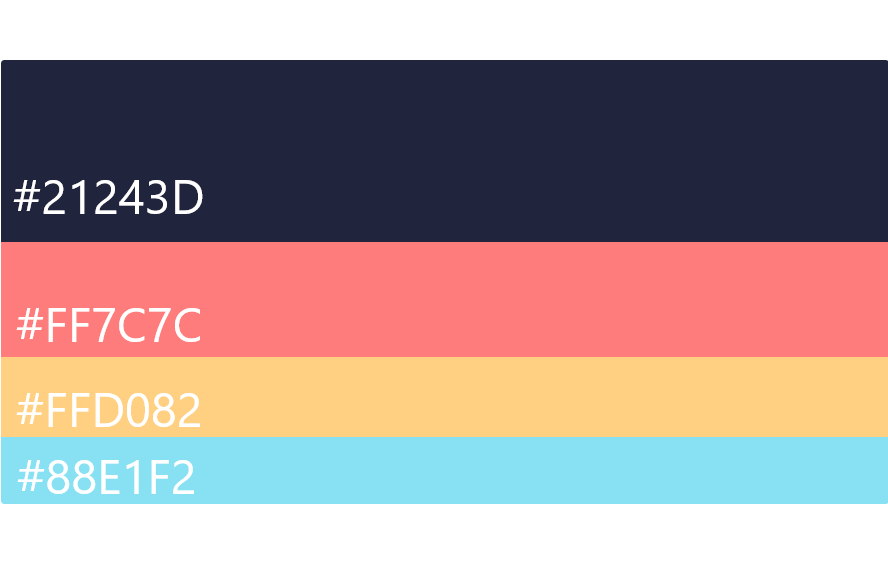

# DIU - Practica 3, entregables

## 1. Análisis de MuseMap   

Vamos a analizar la variedad de métodos UX que han usado los diseñadores de la app **MuseMap**, que busca acercar el arte urbano a los ciudadanos de Londres. El análisis lo hemos hecho en función a [este artículo](https://blog.prototypr.io/musemap-street-art-app-ux-case-study-9bec6a99823b) publicado en su blog.

Al final de este análisis de cada componente, hemos seleccionado los que creemos más relevantes para el proceso de diseño.

### 1.1. User Research

Lo primero que hicieron fue plantearse  las necesidades y objetivos que podrían tener los usuarios de la aplicación mediante una lluvia de ideas.

### 1.2. Contextual Inquiry

Deciden ir a Hyde Park a ver la Mastaba, una obra de arte, y observar a la gente para sacar unas conclusiones, como que la gente ve las obras por poco tiempo, que toman alguna foto y que no hay información sobre la obra cerca.

#### 1.3. Competitive Analysis

Mediante un análisis de la competitividad, extrajeron características en común de las apps sobre arte urbano ya existentes (mapas interactivos, puntos importantes, enlace a RRSS para compartir, base de datos con información sobre los autores y sus obras) y también cayeron en la cuenta de que hacían falta recomendaciones sobre los usuarios o recomendaciones con más votos.

#### 1.4. Empathy Map

Hacen _brainstorming_ para crear un mapa de empatía que les ayude a identificar las preguntas correctas para las entrevistas de usuario.

#### 1.5. User Interviews

Realizaron una encuesta accesible para todo el mundo, gracias a la cual recibieron mucho feedback. Después, seleccionaron entre estos encuestados a la gente más acorde como usuario tipo para ésta app y se le realizaron entrevistas.

#### 1.6. Affinity Mapping

En este paso, plasman los datos obtenidos en un mapa de afinidad con el que llegan a la conclusión de que hay diferencias entre lo que originalmente habían planteado y los resultados arrojados.

#### 1.7. User Personas

Han creado dos user personas con sus respectivas metas y frustraciones y sobre su manera de recibir el arte urbano cuando se dan de bruces con él, de manera accidental o intencionada,  respectivamente.

#### 1.8. User Journey

Para ejemplificar un caso práctico, hacen un _user journey map_. En resumen, resaltan la imposibilidad de Tom para encontrar información del artista al tomar la foto.

#### 1.9. Experience Map

Para realizar un estudio sobre la dinámica en la cual Tom (el personaje que recibe las obras de forma accidental) podria necesitar la app, han realizado un mapa de experiencia en la cual analizan exhaustivamente el proceso en el que Tom se encuentra con la obra, saca una foto de ella, busca información acerca de ella y se va, en la que se analizan el escenario, el trayecto, sus emociones y sus acciones.

#### 1.10. Problem Statement
Plantean el problema: La gente que vive o visita Londres necesitan alguna manera de implicarse más con el arte público. 

Entonces, se plantean los _how might we_ (_¿Cómo podríamos...?)_. Llevar el arte público a la gente, prolongar la interacción con el arte público, hacer que ver arte público dure más que el tomar una foto, etcétera.

Finalmente, llegan a una hipótesis, con la que ellos pretenden mejorar la experiencia general de la gente con el arte callejero.

#### 1.11. User Flow

A la hora del proceso de diseño, decidieron empezar por esquematizar el flujo del comportamiento del usuario Tom a la hora de encontrar una obra cerca de él, desde la obtención de un mapa filtrado relacionado con su posición, pasando por la descripción de la obra que el haya elegido y finalizando con la subida de la foto a sus RRSS.

#### 1.12. Design Studio

Se reúnen para comenzar a idear los bocetos primerizos para ver cómo sería la app. Algo muy destacable, un mapa interactivo a modo de minijuego, con el que la gente descubriese obras de arte ocultas. Siguiendo esto, proponen elegir una obra oculta al día.

#### 1.13. Feature Prioritisation

Mediante una matriz 2x2, distribuyeron las características de la app según el nivel de prescindibilidad y cantidad de trabajo que requiere cada característica, concluyendo que lo más importante era el social media, la función de cámara y la información sobre el arte que venga próximamente.

#### 1.14. 1st Iteration of Paper Prototype

Finalmente empiezan a crear los primeros _wireframe_ en papel. El ejemplo que muestran es cómo se vería la parte de la obra de arte diaria oculta que mencionan anteriormente. El factor juego que incluyen promueve al usuario a hacer fotos y crear contenido para la app.

#### 1.15. Usability Testing 1st Round- with Paper Prototype

El primer prototipo sobre el diseño de la app hecho a mano acabó en descartado, ya que ponía bastantes trabas a los usuarios para su correcto uso.

#### 1.16. 2nd Iteration of Paper Prototype

Aquí concluyen en **empezar de nuevo** y empezar con una **idea nueva totalmente nueva**. Los _wireframe_ que hacen entonces se enfocan en ofrecer un mapa interactivo y **puntos de interés** para poder ver arte y hacer fotos.

#### 1.17. Hi-Fi Digital Wireframes

A partir de los bocetos realizados anteriormente, realizaron unos diseños mediante la aplicación Sketch, logrando un diseño mucho más próximo al propio de una app y perfeccionando detalles en torno al diseño final de ésta.

#### 1.18. Usability Testing 2nd Round with Hi-Fi Digital Wireframes:
En este paso ponen a prueba los _wireframes_ Hi-Fi y encuentran algunos problemas expuestos por usuarios:

+ Esperaban filtrado por tipo de arte y no palabras clave.
+ Querían deslizar hacia arriba para el menú de filtros, pero se accedía por toque.
+ Demasiado énfasis en el botón de cámara de la navbar.

#### 1.19. SiteMap

Realizan un _sitemap_ con los _mock-ups_ de la app. Este _sitemap_ resulta muy claro y detallado, y describen la operación de tomar una foto de cierta obra y subirla.

#### 1.20. Style guide

En el estilo de la app se centraron en utilizar la tipografía Archivo Narrow y colores, que supuestamente estaban creando tendencia en ese momento.

#### 1.21. Final Mock-Ups

Ya, como último paso, crean unos _mock-ups_ de alta definición para la aplicación, donde exponen su idea de cómo se va a ver la aplicación.

#### 1.22. Next Steps
Cuando el prototipo final estaba ya acabado, empezaron a surgir nuevas propuestas sobre el futuro de la app, relacionadas con el testeo de ésta, la integración de más competencias de social media, la creación de perfiles y feed y la posibilidad de seguirse los usuarios unos a otros.

### Métodos más importantes
Para nosotros, los métodos más importantes han sido el __Empathy Map__, **Usability Testing 2nd Round with Hi-Fi Digital Wireframes**, **Final Mockups** y lo explicamos a continuación

#### Empathy Map
Con este método, llegan a obtener una serie de preguntas que se van a hacer a posibles usuarios de la aplicación. Al tener esto, saben cómo encauzar el diseño de la aplicación.

#### Usability Testing 2nd Round
Cuando llegan a este punto, ellos tienen una idea de diseño que les parece buena. Pero se dan cuenta de que su idea no es tan buena como parece, tiene fallos, cosas que mejorar, acciones que otra gente prefiere hacer de otra manera... En resumen, les "abre los ojos" en cuanto a lo que pensaron.

#### Final Mockups
Aquí diferenciamos dos vertientes. La primera, da una idea bastante aproximada de lo que será tu aplicación, lo que te puede servir para venderla o mostrarla. En la otra, podríamos hablar de un _factor motivación_ que impulsa al equipo. Es muy gratificante ver cuando tus proyectos toman forma.

Para nosotros, los métodos más importantes han sido el Empathy Map, Usability Testing 2nd Round with Hi-Fi Digital Wireframes, Final Mockups y lo explicamos a continuación

## 2. Propuesta de elementos de diseño o patrones a usar 

Para los patrones de diseño nos vamos a basar en los proporcionados por la Guía de Google. Adaptándolos a lo necesario en nuestro servicio, nos quedamos con:

1. **Muestre el valor de su aplicación en primer lugar.** No es necesario que se registre para ver el funcionamiento (buscar cenas o cursos, usuarios, etc), pero sí para, por ejemplo, reservar una plaza en una cena o curso.
2. **Permita realizar transiciones entre las aplicaciones para dispositivos móviles y la Web móvil sin inconvenientes.** Queremos que la integración entre la web y la app sea perfecta. Las mismas acciones se deben poder hacer en ambos sitios.
3. **Incluya el campo de búsqueda en una posición destacada.** La búsqueda deberá estar situada en la página principal. Creemos que en nuestro caso es el componente principal de la aplicación.
4. **Use un método de indexación de búsqueda eficaz.** En relación al punto anterior, la búsqueda debe arrojar resultados concisos.
5. **Proporcione opciones para filtrar y ordenar los resultados.** Sigue en relación con la búsqueda; el usuario puede filtrar por términos como ciudad, número de personas de la actividad, si es cena/curso/otro, tipo de comida, etcétera.
6. **Permita ver y filtrar las opiniones de los usuarios.** Muy importante, ya que quien usa la aplicación quiere conocer experiencias previas de otros usuarios con un anfitrión, o incluso el anfitrión para saber a quién mete en su casa o local.
7. **Proporcione varias opciones de pago externas.** Mucha gente se siente más cómoda pagando con PayPal, así que es un punto a tener muy en cuenta. Si sólo proporcionas un método de pago, los usuarios se muestran más reacios a contratar cualquier servicio.
8. **Haga que la autenticación de contraseñas sea una experiencia sin inconvenientes.** Hoy día, existen más maneras de autenticarse aparte de la contraseña (y más rápidas y seguras), como Touch ID y Face ID en el caso de iOS y Mac OS. Creemos que es fundamental integrarlas en nuestro servicio.
9. **Solicite permisos en un contexto relevante.** Si nuestra app usa el teléfono, la cámara, la ubicación, etcétera, no es conveniente pedirle los permisos al usuarios la primera vez que usa la app, sino ir pidiéndolos progresivamente conforme acceda a las funciones.

### Tipografía

Hemos seguido la guía [Best practices for using typography in web design](https://hackernoon.com/9-best-practices-for-using-typography-in-web-design-f56ea5bf1001) y el [Typography Handbook](https://typographyhandbook.com/). 

De ambas, destacar que hay que mantener un diseño limpio, fuentes que no sean 
extravagantes, difíciles de leer, mantener una jerarquía (niveles de títulos, p.e.)

+ Mantener un **diseño limpio**. Cuanto más simple sea la fuente (para el mayor porcentaje de texto), mejor. No queremos una fuente extravagante y cargada que canse al usuario.
+ Limitar el uso de estas fuentes *cargadas*. Si vamos a usarlas, que sea en sitios donde realmente se necesiten, como una imagen.
+ Usar una **jerarquía de niveles**. Las fuentes deben estar claramente diferenciadas entre título, subtítulo, texto normal, etcétera.
+ ¿Cuál es nuestro _target_? La aplicación no está dirigida a niños, por lo que no se van a utilizar fuentes infantiles; tampoco somos un periódico, así que una fuente demasiado sobria puede aburrir.

Creemos que nuestra aplicación se debe diferenciar, más que por el contenido de las fuentes, por lo que realmente ofrecemos sobre otras aplicaciones. Con esto nos referimos a que la aplicación, en Android, usará las fuentes típicas del Material Design, y en iOS, las que sigue el estándar de Apple.

+ **Para Android**: la fuente será [Roboto](https://material.io/design/typography/the-type-system.html#type-scale).
+ **Para iOS**: la fuente será [San Francisco](https://developer.apple.com/design/human-interface-guidelines/ios/visual-design/typography/).
+ **Para web**: la fuente será [Helvetica](https://www.fonts.com/font/linotype/helvetica).

### Paleta de colores

Para la paleta de colores hemos utilizado [Colorhunt](https://colorhunt.co/). La paleta diseñada será esta:

## Historia en Video del UX Case Study

## Documentación. Valoración del equipo sobre la realización de esta práctica o los problemas surgidos
